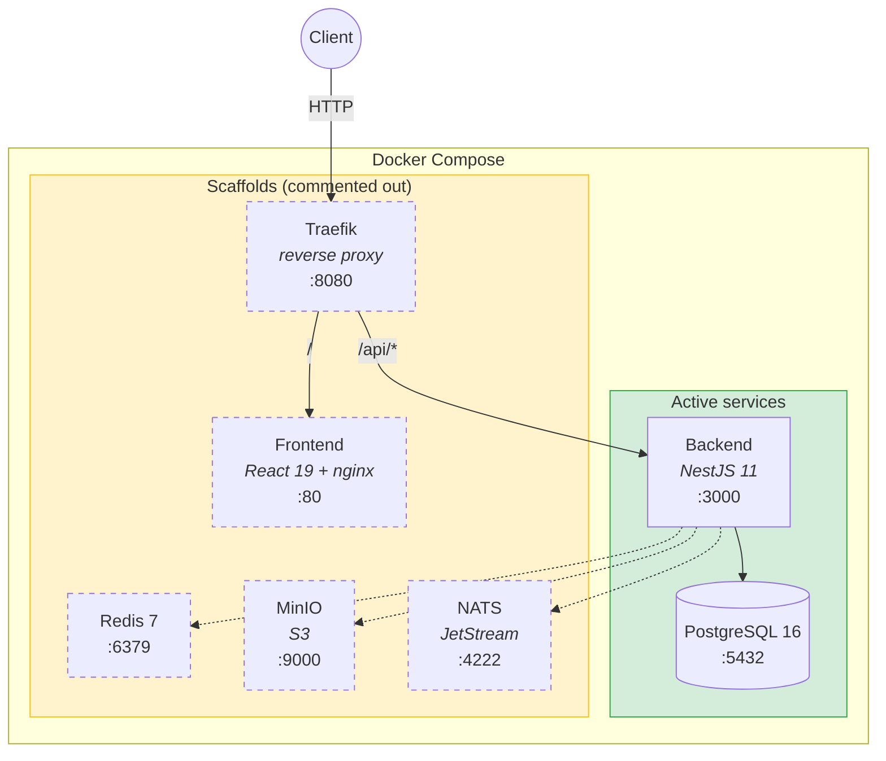

# DSP Boilerplate

Fullstack boilerplate: **NestJS 11** (backend) + **React 19 / Vite 7** (frontend), unified in a single Docker Compose setup with ready-made infrastructure: PostgreSQL, Redis, S3 (MinIO), NATS, Traefik.

## Architecture



## Services

| Service | Stack | Description | Documentation |
|---------|-------|-------------|---------------|
| **Backend** | NestJS 11, TypeScript, TypeORM | REST API, Swagger | — |
| **Frontend** | React 19, Vite 7, Tailwind 4, DaisyUI | SPA with i18n (5 languages), SEO, Orval | [frontend/README.md](frontend/README.md) |
| **PostgreSQL** | postgres:16-alpine | Primary database | — |

## Project Structure

```
├── src/                          # Backend (NestJS)
│   ├── main.ts                   # Bootstrap
│   ├── app.module.ts             # Root module
│   ├── app.controller.ts         # Health-check controller
│   ├── app.service.ts            # App service
│   ├── typeorm-cli-datasource.ts # TypeORM CLI datasource
│   ├── lib/
│   │   ├── common/               # Utilities (config, env, validation, S3, NATS, moment)
│   │   ├── infra/                # Infrastructure modules (Global, TypeORM, Redis, S3, NATS)
│   │   ├── entity/               # TypeORM entities
│   │   └── dto/                  # DTO (class-validator + Swagger)
│   └── services/
│       └── example/              # Example CRUD service
├── frontend/                     # Frontend (React 19 + Vite 7) → see frontend/README.md
│   ├── src/                      # Source code (pages, components, hooks, i18n)
│   ├── api.yaml                  # OpenAPI spec for Orval
│   ├── Dockerfile                # Multi-stage: Node → nginx
│   └── README.md                 # Detailed frontend documentation
├── docker-compose.yml            # PostgreSQL, Redis, MinIO, NATS, Traefik
├── Dockerfile                    # Backend image
└── .env                          # Environment variables
```

## Infrastructure Modules

Registered in `AppModule`:

- **GlobalInfraModule** — `GlobalConfig` (APP_ENV, APP_PORT, APP_HOST, APP_PREFIX)
- **TypeORMInfraModule** — PostgreSQL via TypeORM (auto-registers entities from `src/lib/entity/index.ts`)

Ready-made scaffolds (enable as needed):

- **RedisInfraModule** — Redis via `@nestjs-modules/ioredis`
- **S3InfraModule** — S3 via `nest-aws-sdk`
- **NatsInfraModule** — NATS via `@nestjs/microservices`

## Quick Start

```bash
# Configure environment (edit to suit your needs)
# .env already contains working values for docker-compose

# Start with Docker Compose
docker-compose up -d

# Swagger UI
# http://localhost:3000/api/docs
```

## Local Development

```bash
yarn install
yarn start:dev
```

## Scripts

| Command | Description |
|---------|-------------|
| `yarn start:dev` | Dev mode with hot-reload |
| `yarn start` | Normal start |
| `yarn start:prod` | Run compiled `dist` |
| `yarn build` | Build |
| `yarn migration:create src/migrations/<Name>` | Create empty migration |
| `yarn migration:generate src/migrations/<Name>` | Generate migration from schema |
| `yarn migration:run` | Run migrations |
| `yarn migration:revert` | Revert last migration |

## Environment Variables

All configs are validated at startup via `class-validator`.

| Variable | Description | Default |
|----------|-------------|---------|
| `APP_ENV` | Environment (dev/prod) | — |
| `APP_PORT` | Application port | `3000` |
| `APP_HOST` | Public origin | `http://localhost:3000` |
| `APP_PREFIX` | Global API prefix | `api` |
| `POSTGRES_HOST` | PostgreSQL host | — |
| `POSTGRES_PORT` | PostgreSQL port | — |
| `POSTGRES_DB` | Database name | — |
| `POSTGRES_USER` | User | — |
| `POSTGRES_PASSWORD` | Password | — |
| `TYPEORM_SYNCHRONIZE` | Schema synchronization | `false` |
| `TYPEORM_LOGGING` | SQL logging | — |
| `REDIS_HOST` | Redis host | `localhost` |
| `REDIS_PORT` | Redis port | `6379` |
| `S3_BUCKET` | S3 bucket | — |
| `S3_ENDPOINT` | S3 endpoint | — |
| `S3_ACCESS_KEY_ID` | S3 access key | — |
| `S3_SECRET_ACCESS_KEY` | S3 secret key | — |
| `S3_REGION` | S3 region | — |
| `NATS_SERVERS` | NATS servers (comma-separated) | `nats://localhost:4222` |

## Docker Compose

Active services: **Backend (NestJS)** + **PostgreSQL**.

Commented-out service scaffolds (uncomment as needed):

- **Traefik** — reverse proxy (single entry point `localhost:8080` for frontend and API)
- **Frontend** — React + Vite (nginx static), served via Traefik
- **Redis** — cache / pub-sub (uncomment along with `RedisInfraModule` in `AppModule`)
- **MinIO** — S3-compatible object storage (uncomment along with `S3InfraModule` in `AppModule`)
- **NATS** — message broker with JetStream (uncomment along with `NatsInfraModule` in `AppModule`)

When uncommenting a service, don't forget to also uncomment the corresponding `depends_on` in the `app` section.

Without Traefik, Swagger is available directly at: `http://localhost:3000/api/docs`

## Adding a New Entity

1. Create file `src/lib/entity/MyEntity.entity.ts`
2. Re-export from `src/lib/entity/index.ts`
3. TypeORM will pick up the entity automatically

## DSP (Data Structure Protocol)

The project has an initialized [DSP](https://github.com/k-kolomeitsev/data-structure-protocol) graph in the `.dsp/` directory — a structural memory of the codebase for LLM agents. It stores entities (modules, functions, external dependencies), their relationships (imports/exports), and reasons for every connection.

Two roots (entry points):

| Root | TOC file | Entry point |
|------|----------|-------------|
| **Backend** | `TOC-obj-82e23068` | `src/main.ts` |
| **Frontend** | `TOC-obj-ca619436` | `frontend/src/main.tsx` |

All source files contain `// @dsp <uid>` markers linking code to graph entities.

Key commands:

```bash
# Overview
dsp-cli get-stats
dsp-cli read-toc --toc obj-82e23068   # backend TOC
dsp-cli read-toc --toc obj-ca619436   # frontend TOC

# Search & navigate
dsp-cli find-by-source <path>
dsp-cli search <query>
dsp-cli get-entity <uid>
dsp-cli get-children <uid> --depth N
dsp-cli get-parents <uid> --depth N
```
